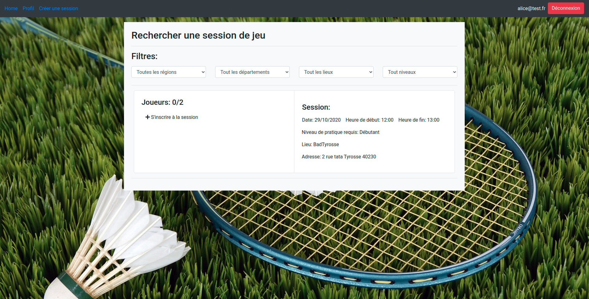
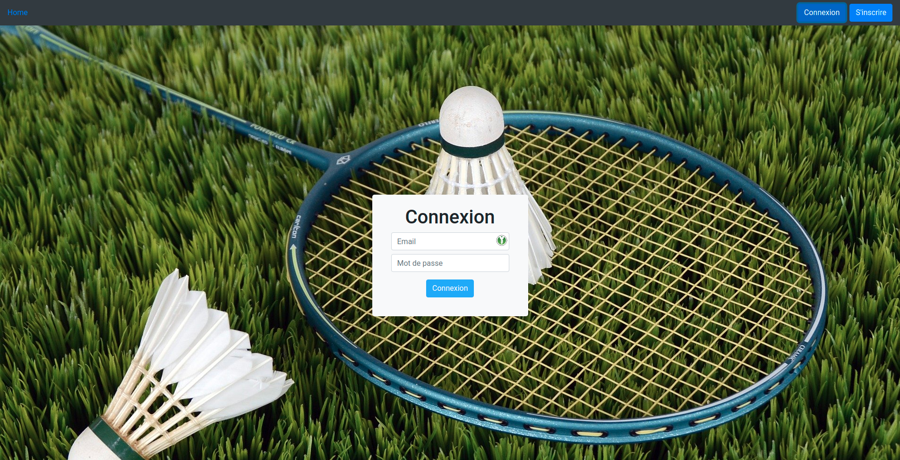

# Match a Mate

## Présentation

Match a Mate est une application web  de mise en relation de partenaires pour pratiquer les sport de raquettes. Les sports représentés sont le badminton, le tennis, le padel et le squash. L'application permet aux joueurs de s'inscrire sur des créneaux de jeux proposés par des entreprises mettant à disposition les infrastructures permettant de jouer. Cette application a été réalisée dans le cadre du parcours Développeur d'application Java de la plateforme d'enseignement OpenClassrooms.

## Guide de démarrage

### Prérequis

* _Java-11_ et plus
* _MongoDB-3.6_ et plus
* _Node.JS-12.19.0_ et plus
* _Angular-10_ et plus

### Démarrage

#### Code source

Récupérer le code source entreposé dans le dépôt git à l'adresse suivante : https://github.com/ccathala/matchamate

Le code source est composé des répertoire suivants:
  * _databases_linux_ qui contient les base de données compatibles linux
  * _databases_windows_ qui contient les base de données compatibles windows
  * _jars_ qui contient les executables des différents services au format .jar
  * _matchamate-webapp_ contient le code source de l'application web
  * _README_ qui fournit des informations sur le projet
  
 #### Démarrer les bases de données
 
 ##### Linux
 
 Ouvrir un terminal à l'emplacement du répertoire databases_linux/
 
 Utiliser la commande suivante pour lancer le script _matchamate_db_launch.sh_
 
 ```sudo bash matchamate_db_launch.sh```
 
 ##### Windows
 
 Ouvrir un terminal à l'emplacement du répertoire databases_windows/
 
 Utiliser la commande suivante pour lancer le script _matchamate_db_launch.bat_
 
 ```matchamate_db_launch.bat```
 
 #### Démarrer les services
 
 ##### Linux
 
 Ouvrir un terminal à l'emplacement du répertoire matchamate-app/jars/
 
 Utiliser une des commandes suivantes pour lancer le service désiré:
 
 Lancer le service company:
 
 ```java -jar ./matchamate-company-api-0.0.1-SNAPSHOT.jar```
 
 Lancer le service player:
 
 ```java -jar ./matchamate-company-api-0.0.1-SNAPSHOT.jar```
 
 Lancer le service session:
 
 ```java -jar ./matchamate-company-api-0.0.1-SNAPSHOT.jar```
 
 Lancer le service gateway:
 
 ```java -jar ./matchamate-company-api-0.0.1-SNAPSHOT.jar```
 
 Lancez les quatre services simultanément.
 
 ##### Windows
 
 Ouvrir un terminal à l'emplacement du répertoire matchamate-app/jars/
 
 Utiliser la commande suivante pour lancer le script _matchamate_launch_jars_windows.bat_
 
 ```matchamate_launch_jars_windows.bat```
 
 #### Démarrer l'application web
 
 Ouvrir un terminal à l'emplacement du répertoire matchamate-app/webapp/
 
 Utiliser la commande suivante pour lancer l'application web
 
 ```ng serve```
 
 Accéder à l'application via l'url : https://localhost:4200
 

#### Utilisateurs enregistrés

##### Joueurs

Identifiant : cecile@test.fr  
Mot de passe : azerty

Identifiant : dimitri@test.fr  
Mot de passe : azerty

Identifiant : alice@test.fr  
Mot de passe : azerty


##### Entreprises

Identifiant : badlandes@gmail.com  
Mot de passe : azerty

Identifiant : badcharente@gmail.com  
Mot de passe : azerty

Identifiant : badhautegaronne@test.fr  
Mot de passe : azerty


##### Administrateur

Identifiant : admin@matchamate.fr  
Mot de passe : azerty

## Technologies utilisées

* JEE
* Spring
  * Spring Boot
  * Spring Security
  * Spring MVC
  * Spring Data REST
  * Spring Data Mongo
* REST
* MongoDB
* Zuul
* Angular
* Bootstrap
* HTML
* CSS
* Junit
* Maven

## Aperçu du site





## Dépots tiers

### Services:
* company: https://github.com/ccathala/matchamate-company-api
* player: https://github.com/ccathala/matchamate-player-api
* session: https://github.com/ccathala/matchamate-session-api
* gateway: https://github.com/ccathala/matchamate-gateway

### Webapp: 
* https://github.com/ccathala/matchamate-webapp

## Auteur

* **Charles Cathala** - [ccathala](https://gist.github.com/ccathala)
